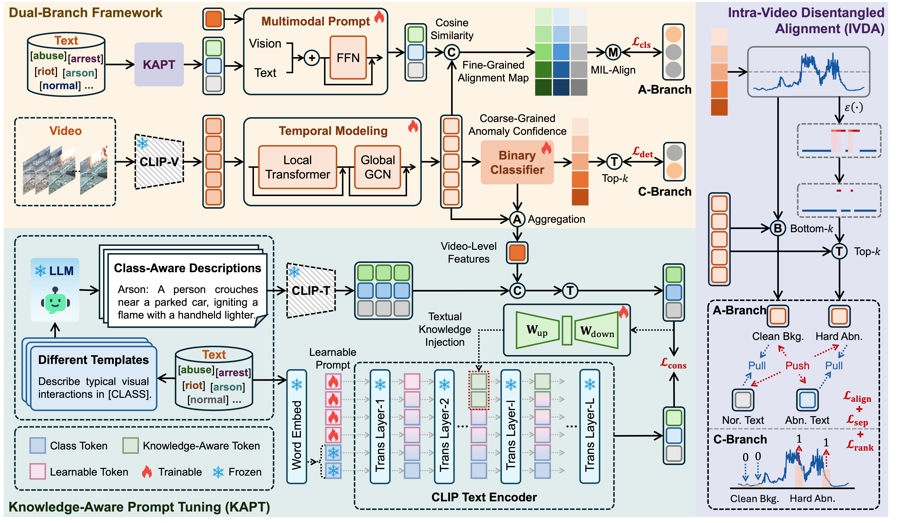

# Co-VAD
This repo contains the Pytorch implementation of our paper:
> **Consistency-Guided Prompt Learning for Weakly Supervised Video Anomaly Detection**
>



### Setup
We extract CLIP features for UCF-Crime and XD-Violence datasets, and release these features and pretrained models as follows:

> [**CLIP Features**](https://github.com/nwpu-zxr/VadCLIP)

The following files need to be adapted in order to run the code on your own machine:
- Change the file paths to the download datasets above in `list/xd_train.csv` and `list/xd_test.csv`.
- Feel free to change the hyperparameters in `xd_option.py`

### Train and Test
After the setup, simply run the following command: 

Traing and infer for XD-Violence dataset
```
python src/xd_train.py
python src/xd_test.py
```
Traing and infer for UCF-Crime dataset
```
python src/ucf_train.py
python src/ucf_test.py
```

## References

We referenced the repos below for the code:

* [VadCLIP](https://github.com/nwpu-zxr/VadCLIP)

## Citation

If you find this repo useful for your research, please consider citing our paper:

```bibtex
